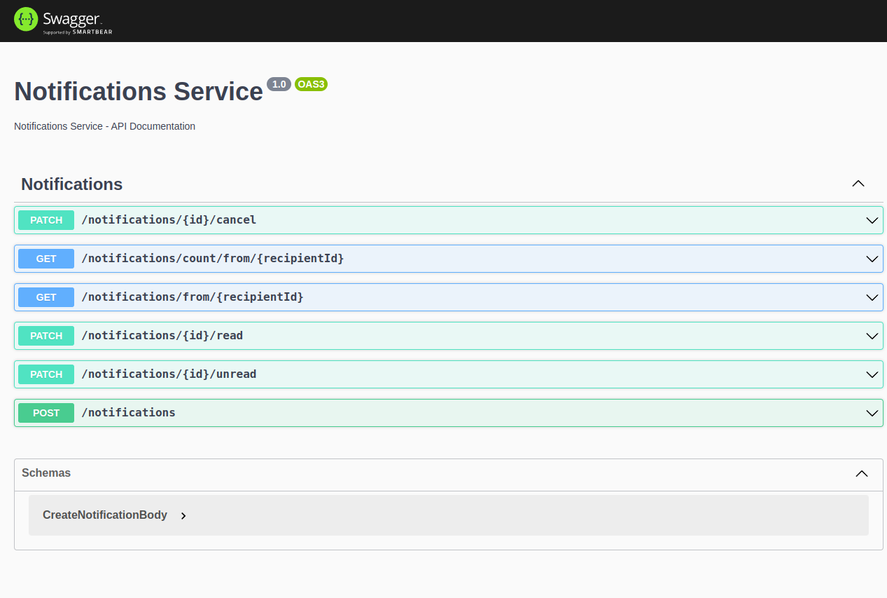

## Notifications Service - Ignite Lab | NodeJS
<br>

 ## 🚀 Tecnologias e Conceitos
```
- DDD – Domain-Driven Design
- Jest
- NestJS
- Node.js
- PostgreSQL
- Prisma
- Repository Pattern
- SOLID
- Swagger
- TypeScript
```
## ⚡ Instalando o Projeto

```bash
# clonar o projeto
git clone git@github.com:GeorgePires/ignite-lab-nodejs.git

# entre no diretório clonado
cd ignite-lab-nodejs

# instalar dependências do Node/NestJS
npm install

# executar o projeto
npm run start
```

```bash
# executar testes
npm run test

npm run test:cov
```

### 🔰 API Rotas
<br>

```bash
# Swagger
- http://localhost:3000/api
```
<div align="center">
    
</div>
<br>

CreateNotificationBody

```json

    {
        "content": "Nova solicitação de amizade",
        "category": "social",
        "recipientId": "UUID"
    }
```

---
