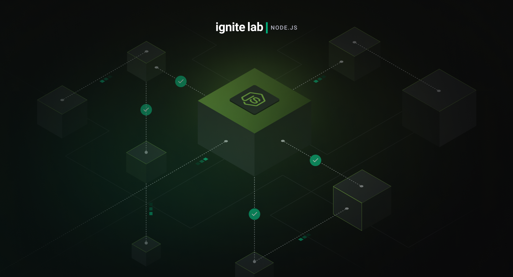

## Notifications Service - Ignite Lab | NodeJS

<br>
<div align="center">
    
</div>
<br>

## ⚡ Instalando o Projeto

```bash
# clonar o projeto
git clone git@github.com:GeorgePires/ignite-lab-nodejs.git

# entre no diretório clonado
cd ignite-lab-nodejs

# instalar dependências do Node/NestJS
npm install

# executar o projeto
npm run start
```

```bash
# executar testes
npm run test

npm run test:cov
```

---